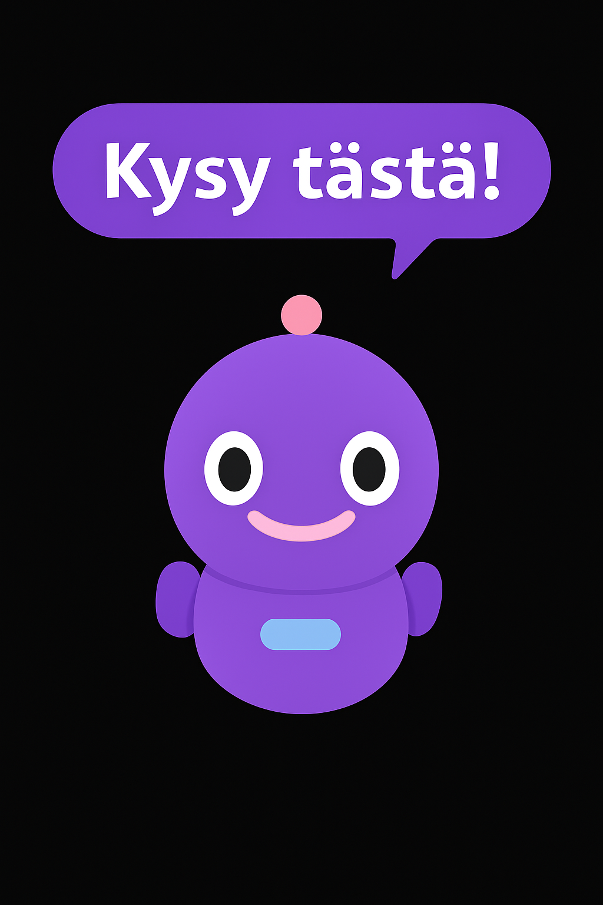

# Sci-Fi Robotti Chatbot 🤖

Interaktiivinen chatbot-esittely, jossa hauska robotti vastaa projektikohtaisiin kysymyksiin.  
Sopii täydellisesti portfolioon projektien esittelyyn.

---

## 🔧 Ominaisuudet

- Klikattava robotti-ikoni, joka avaa keskustelulaatikon
- Botti osaa kertoa teknologioista, haasteista ja projektin taustoista
- Animaatioilla elävöitetty ulkoasu
- Helposti muokattava: voit lisätä omat projektisi ilman backend-koodia

---

## 🖼️ Kuvakaappaus



---

## 🚀 Käyttöönotto

### 🔹 Vaihtoehto 1: Lisää botti tietyn projektin yhteyteen

```html
<div class="project-header">
  <h2>Projektin nimi</h2>
  <button class="ai-button" data-project="oma-projekti-id"></button>
</div>
```

### 🔹 Vaihtoehto 2: Lisää vain pelkkä bottinappi mihin tahansa kohtaan

```html
<button class="ai-button" data-project="oma-projekti-id"></button>
```

### 🔹 Lisää JS-tiedostot ennen `</body>`-tägiä

```html
<script src="js/responses.js"></script>
<script src="js/chatbot.js"></script>
<script src="js/robot-animation.js"></script>
```

### 🔹 Lisää oma sisältösi `responses.js`-tiedostoon

```js
const responses = {
  "oma-projekti-id": {
    "yleistä": "Tämä projekti on rakennettu HTML:llä ja CSS:llä.",
    "teknologiat": "HTML, CSS, JavaScript",
    "haasteet": "Interaktiivisuuden toteutus ja ulkoasun viimeistely.",
  }
};
```

---

## 🎨 Mistä muokata?

- **`responses.js`** – Lisää projektien vastaukset
- **`chatbot.js`** – Muuta bottin logiikkaa, kysymysjärjestystä jne.
- **`chatbot.css`** – Chat-ikkunan ulkoasu
- **`robot-icon.css`** – Robottinapin ulkoasu ja animaatiot

---

## 📁 Projektin rakenne

```
sci-fi-chatbot/
├── index.html              # Esimerkkisivu testaukseen
├── css/
│   ├── robot-icon.css      # Robotti-ikonin tyylit
│   └── chatbot.css         # Chat-ikkunan ulkoasu
├── js/
│   ├── chatbot.js          # Bottin logiikka
│   ├── robot-animation.js  # Nappien animointi
│   └── responses.js        # Projektien vastaukset
└── README.md               # Käyttöohjeet
```

---

## 🧪 Demo

Avaa `index.html` selaimessa ja testaa bottia valmiilla esimerkkiprojekteilla.  
Voit kopioida rakenteen omaan portfolioosi ja muokata halutun näköiseksi.

---

## 📄 Lisenssi

Vapaa käyttää, jakaa ja muokata.  
Krediitti tai ⭐ GitHubissa lämmittää sydäntä – ja robotin prosessoria.
